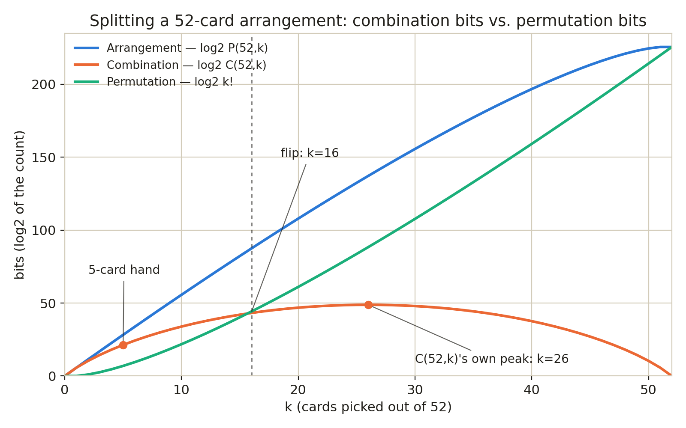
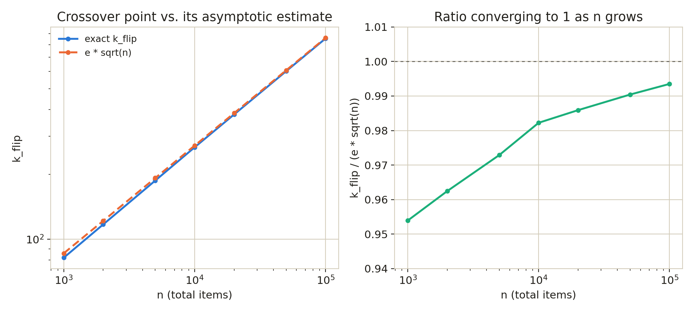

# Arrangement information: when order costs more than choice

POKER.md already showed the two halves of an arrangement: choosing 5
cards out of 52 is a `Distinct_Combinator`, ordering that choice is
what a `Distinct_Permutator` would add on top, and `Distinct_Arranger`
does both at once. For a 5-card hand, most of that arrangement's
information turns out to be "which cards" -- POKER.md's whole
combination-index trick rests on that being true. It stops being true
somewhere between a 5-card hand and a full 52-card shuffle: a full
shuffle carries zero "which cards" information (there's only one way
to grab all 52) and all of it is "in what order". This file finds
exactly where the balance flips, and how that flip point scales with
deck size in general.

*(A worked example that stands on its own -- it doesn't require
having read POKER.md first, though the deck it starts from is the
same one.)*

## The exact split

`Distinct_Arranger` (order-sensitive picks, no repeats) is a
`Distinct_Combinator` times a `Distinct_Permutator`-sized factor:
picking which `k` items, then picking one of `k!` orderings for them.
That's not just true of the counts, it's true bit for bit, because
`log2` turns a product into a sum:

```python
>>> from esets import Distinct_Arranger, Distinct_Combinator
>>> from math import log2, factorial
>>> items = list(range(52))
>>> for k in (5, 16, 52):
...     a = Distinct_Arranger(items, k)
...     c = Distinct_Combinator(items, k)
...     assert a.len() == c.len() * factorial(k)
...     print(k, round(log2(a.len()), 6), round(log2(c.len()) + log2(factorial(k)), 6))
...
5 28.216394 28.216394
16 87.486674 87.486674
52 225.581003 225.581003

```

(Rounded rather than compared to full float precision: `log2(a.len())`
and `log2(c.len()) + log2(factorial(k))` reach the same value by two
different chains of floating-point operations, and those chains don't
always land on the exact same last bit -- a small, harmless reminder
that floats are approximate even when the underlying identity is
exact, distinct from the much larger int-to-float precision loss
TEXTENCODE.md's own precision section demonstrates.)

`log2(a.len())` is the total information content of an arrangement:
however many bits it takes to name one specific ordered pick out of
all possible ones. That total is always exactly `log2(c.len())` (the
"which items" bits) plus `log2(factorial(k))` (the "what order" bits)
-- an identity, not an approximation, so asking which half is bigger
is a real question with a real answer, not a fuzzy one.

## Where it flips, for a 52-card deck

At `k=5` the combination half dominates heavily -- that's the whole
reason POKER.md's combination-index trick is worth doing. At `k=52`
the combination half is zero (there's exactly one way to choose all
52 cards) and the permutation half carries everything. Somewhere in
between, the two swap places:

```python
>>> n = 52
>>> log2fact = [0.0]
>>> for i in range(1, n + 1):
...     log2fact.append(log2fact[-1] + log2(i))
...
>>> def log2_comb(n, k):
...     return log2fact[n] - log2fact[k] - log2fact[n - k]
...
>>> combination_bits = [log2_comb(n, k) for k in range(n + 1)]
>>> permutation_bits = [log2fact[k] for k in range(n + 1)]
>>> flip = next(k for k in range(1, n + 1) if permutation_bits[k] >= combination_bits[k])
>>> flip
16
>>> round(combination_bits[15], 2), round(permutation_bits[15], 2)
(42.03, 40.25)
>>> round(combination_bits[16], 2), round(permutation_bits[16], 2)
(43.24, 44.25)

```

`log2fact` is built once as a running sum rather than by calling
`factorial(k)` and converting it to a float afterward, for the same
reason TEXTENCODE.md's precision section flags: a running sum of
`log2(i)` never routes through `factorial(52)` (or, in the next
section, `factorial(100000)`) as an intermediate value that then has
to survive a lossy `float()` conversion -- it accumulates the
logarithm directly, so there's nothing large to lose precision on.

At `k=15`, combination bits (42.03) still edge out permutation bits
(40.25); by `k=16`, permutation bits (44.25) have pulled ahead of
combination bits (43.24) and never fall back, since `C(n,k)` is
already past its own peak (which sits at `k=n/2=26` by symmetry) while
`k!` keeps compounding all the way to `k=n`. A 5-card poker hand, at
`k=5`, sits well inside the combination-dominated region -- eleven
cards short of the flip.

## The combination curve's own peak

Unlike `P(n,k)` and `k!`, both monotonically increasing in `k`,
`C(n,k)` rises and then falls back to 1 -- symmetric around `n/2`,
since choosing which `k` to keep is the same act as choosing which
`n-k` to leave out (`C(n,k) == C(n,n-k)` by definition). Where it
turns over falls out of the ratio between consecutive terms:
`C(n,k+1)/C(n,k) = (n-k)/(k+1)`, which is at least 1 -- still
climbing -- exactly while `k <= (n-1)/2`. For even `n` that ratio
hits exactly 1 at no integer `k`, so the climb stops one step short
of a tie and there's a single, unique peak at `n/2`:

```python
>>> from math import comb
>>> peak_k = max(range(n + 1), key=lambda k: comb(n, k))
>>> peak_k, peak_k == n // 2
(26, True)
>>> comb(n, 25), comb(n, 26), comb(n, 27)
(477551179875952, 495918532948104, 477551179875952)

```

For odd `n`, the ratio *does* land on exactly 1 at `k=(n-1)/2`, so
the last step is a tie rather than a strict climb, and the peak is
shared by two adjacent `k`:

```python
>>> comb(53, 26) == comb(53, 27)
True
>>> comb(53, 26) > comb(53, 25)
True

```

Tying this back to the flip: the crossover at `k=16` happens well
before `C(52,k)`'s own peak at `k=26` -- permutation content has
already overtaken while the combination curve is still climbing
toward its own maximum, not after. And by the time `C(52,k)` does
peak, it's already far outmatched:

```python
>>> round(log2(comb(52, 26)), 2), round(log2(factorial(26)), 2)
(48.82, 88.38)

```

Two very different senses of "biggest": `C(n,k)`'s own peak is
answering "which `k` has the most ways to choose," while `k_flip` is
answering "which `k` first makes ordering worth more bits than
choosing" -- there's no reason to expect the same `k` answers both,
and here it clearly doesn't.



## The general relationship: k_flip is roughly e times sqrt(n)

Fixing `n=52` and asking "which `k`" is one question; asking how that
flip point moves as the deck itself grows is a different one. It has
a clean closed-form answer.

For `k` small relative to `n`, `C(n,k) = n!/(k!(n-k)!)` is well
approximated by `n**k / factorial(k)` (the top of the fraction is
`k` shrinking terms starting at `n`, each close to `n` itself when
`k << n`). Substituting that into the flip condition
`log2(factorial(k)) = log2(C(n,k))`:

```
log2(k!) ~= log2(n**k / k!)
log2(k!) ~= k*log2(n) - log2(k!)
2*log2(k!) ~= k*log2(n)
log2(k!) ~= (k/2)*log2(n)
```

and Stirling's approximation (`log2(k!) ~= k*log2(k) - k*log2(e)`)
turns the left side into something solvable for `k`:

```
k*log2(k) - k*log2(e) ~= (k/2)*log2(n)
log2(k) - log2(e) ~= (1/2)*log2(n)
log2(k) ~= (1/2)*log2(n) + log2(e)
k ~= e * sqrt(n)
```

`e` falls straight out of the algebra as `2**log2(e)`, not something
fitted after the fact. That predicts a flip point that grows with the
*square root* of the deck size -- doubling `n` should move `k_flip` by
a factor of `sqrt(2) ~= 1.41`, not 2:

```python
>>> from math import e, sqrt
>>> round(e * sqrt(52), 1)
19.6

```

19.6 versus the true `flip = 16` for `n=52` is in the right
neighborhood but not exact, because the approximation leaned on
`k << n`, and 16 isn't all that small next to 52 -- the derivation
should get tighter as `n` grows and `k_flip` becomes a genuinely
smaller fraction of `n`. Checking that against exact crossover points
computed the same running-sum way, for `n` large enough that
`factorial(n)` itself would be an enormous intermediate value even
before any precision is at stake:

```python
>>> def crossover(n):
...     table = [0.0]
...     for i in range(1, n + 1):
...         table.append(table[-1] + log2(i))
...     for k in range(1, n + 1):
...         if table[k] >= table[n] - table[k] - table[n - k]:
...             return k
...
>>> for test_n in (1000, 2000, 5000, 10000, 20000, 50000, 100000):
...     k_flip = crossover(test_n)
...     estimate = e * sqrt(test_n)
...     print(test_n, k_flip, round(estimate, 1), round(k_flip / estimate, 4))
...
1000 82 86.0 0.9539
2000 117 121.6 0.9624
5000 187 192.2 0.9729
10000 267 271.8 0.9822
20000 379 384.4 0.9859
50000 602 607.8 0.9904
100000 854 859.6 0.9935

```

The ratio climbs steadily toward 1 as `n` grows, which is exactly the
"should get tighter" prediction confirmed rather than assumed.



## Is this a known result?

Not as far as a real search turned up. `P(n,k) = C(n,k) * k!` and
Stirling's approximation are both entirely standard, but the specific
question this file asks -- not "which is bigger, P or C" (P is always
at least as big, trivially, by exactly a factor of `k!`) but "where
does `k!`'s own bit-content overtake `C(n,k)`'s" -- didn't turn up a
named theorem, a paper, or a textbook exercise under any phrasing
tried. The `e * sqrt(n)` shape has the same square-root flavor as
other crossover points that show up elsewhere in combinatorics
(birthday-paradox collisions, the ~`2*sqrt(n)` longest-increasing-
-subsequence result), but that's a family resemblance worth noting,
not a citation -- those are different mechanisms answering different
questions. Treat the derivation above as done here, not sourced from
somewhere else.

## One honest boundary

Everything above is about plain `P(n,k)`: order-sensitive picks from
`n` *distinct* items, no repeats, exactly what `Distinct_Arranger`
enumerates. It is not the multiset-capacity-bounded question this
project's own `Natural_Multiset_Arranger` actually ranks (the one
POKER.md's multi-deck section and TEXTENCODE.md's word alphabets both
lean on) -- there, the "what order" factor for a chosen basket of
classes isn't `k!`, it's the multinomial coefficient over the class
counts within that basket (fewer distinct orderings whenever a basket
repeats a class), so the flip point for that version is a genuinely
separate derivation, not a drop-in substitution of `k!` above.

## Generalizing to multisets: grouping the deck into classes

`Natural_Multiset_Arranger`/`Natural_Multiset_Combinator` don't pick
from 52 distinct cards -- they pick from a handful of *classes*, each
with its own capacity, exactly what grouping the deck by suit, by
rank, or by any other criterion produces. The space of every possible
such grouping is enormous and not the useful thing to explore, worth
being precise about why: grouping the 52 *specific* cards into blocks
is a set partition, counted by the Bell number `B(52)`, while only the
resulting *shape* -- the multiset of block sizes, disregarding which
particular cards fill them -- actually affects any of the counts
below, and that's a much smaller space, the integer partitions of 52:

```python
>>> from esets import Partitioner, Set_Partitioner
>>> Partitioner(52).len()
281589
>>> Set_Partitioner(list(range(52))).len()
58205338024195872785464627063218599149503972126463

```

281,589 possible shapes versus a 50-digit number of groupings that
all collapse onto those shapes -- `Set_Partitioner` is answering "how
many ways to sort 52 particular cards into piles," `Partitioner` is
answering "how many distinct pile-size patterns exist," and only the
second question is the one `Natural_Multiset_Arranger`'s counts
depend on. Grouping by suit and grouping by "any other random 13
cards per pile" produce the identical shape `(13, 13, 13, 13)` and
therefore identical arrangement/combination counts, even though
they're wildly different `Set_Partitioner` groupings.

Even 281,589 shapes is too many to sweep exhaustively for a worked
example, so what follows samples a handful of real, recognizable ones
instead of the full shape space: grouping by suit, by rank (already
used in POKER.md's `rank_shapes`), by color, by face-card status, and
by the three-tier grouping blackjack card counting uses:

```python
>>> from esets import Natural_Multiset_Arranger, Natural_Multiset_Combinator
>>> shapes = {
...     'suit':  (13, 13, 13, 13),
...     'rank':  (4,) * 13,
...     'color': (26, 26),
...     'face':  (12, 40),
...     'hilo':  (20, 12, 20),
... }
>>> {name: sum(capacities) for name, capacities in shapes.items()}
{'suit': 52, 'rank': 52, 'color': 52, 'face': 52, 'hilo': 52}

```

`face` splits jacks/queens/kings (`3 ranks * 4 suits = 12`) against
everything else, aces included (`10 ranks * 4 suits = 40`). `hilo`
splits into the three groups the real-world Hi-Lo blackjack counting
system uses (not something POKER.md itself names -- its own aside on
this project's own combination-index choice is about a related but
distinct point, live deck-state updates leaking more than their size
implies, not counting systems specifically): low `2`-`6` (`5*4=20`),
neutral `7`-`9` (`3*4=12`), high `10` through ace (`5*4=20`).

## Why the same split doesn't carry over cleanly

Before reusing the crossover idea, it's worth checking whether the
clean identity from the distinct-item case even survives. It doesn't,
and the reason is concrete: in the distinct case, *every* k-item
combination has exactly `k!` orderings, so the split factors out the
same way regardless of which combination was picked. With repeats
allowed, different combinations of the same size can have wildly
different numbers of orderings -- a basket that's all one class has
exactly one ordering; a basket with no repeats at all has `k!`:

```python
>>> from math import factorial
>>> from collections import Counter
>>> def orderings(basket):
...     counts = Counter(basket)
...     total = factorial(len(basket))
...     for count in counts.values():
...         total //= factorial(count)
...     return total
...
>>> orderings((0, 0, 0, 0, 0))
1
>>> orderings((0, 0, 0, 0, 1))
5
>>> orderings((0, 0, 1, 1, 2))
30
>>> orderings((0, 1, 2, 3, 3))
60

```

Those four are all length-5 combinations drawn from the `suit` shape
`(13, 13, 13, 13)`, and their ordering counts span two orders of
magnitude. Summed across every length-5 combination that shape has,
they reconstruct `Natural_Multiset_Arranger`'s own count exactly:

```python
>>> suit_arranger = Natural_Multiset_Arranger(shapes['suit'], 5)
>>> suit_combinator = Natural_Multiset_Combinator(shapes['suit'], 5)
>>> sum(orderings(basket) for basket in suit_combinator) == suit_arranger.len()
True
>>> suit_arranger.len(), suit_combinator.len()
(1024, 56)
>>> suit_arranger.len() / suit_combinator.len()
18.285714285714285

```

That last ratio -- the *average* number of orderings per combination,
not a universal one -- is the closest multiset analogue of `k!`
available here: `18.29`, nowhere near the distinct case's `5! = 120`
for the same `k`. The split still holds for the *totals* (it's just
algebra: `log2(A) = log2(C) + log2(A/C)`, true for any positive `A`
and `C`), but `log2(A/C)` here means "average per-basket ordering
bits," a genuinely different, weaker quantity than "the ordering bits
of any specific basket," which is what `log2(k!)` meant when every
basket had the same one.

## Where each shape's split flips

With that caveat on record, the same crossover question --
does the aggregate ordering term overtake the aggregate combination
term, and at what `k` -- still has a well-defined answer per shape:

```python
>>> from math import log2
>>> def multiset_flip(capacities):
...     n = sum(capacities)
...     for k in range(1, n + 1):
...         a = Natural_Multiset_Arranger(capacities, k)
...         c = Natural_Multiset_Combinator(capacities, k)
...         comb_bits = log2(c.len())
...         perm_bits = log2(a.len()) - comb_bits
...         if perm_bits >= comb_bits:
...             return k
...
>>> for name in ('suit', 'rank', 'color', 'face', 'hilo'):
...     print(name, shapes[name], multiset_flip(shapes[name]))
...
suit (13, 13, 13, 13) 7
rank (4, 4, 4, 4, 4, 4, 4, 4, 4, 4, 4, 4, 4) 11
color (26, 26) 6
face (12, 40) 6
hilo (20, 12, 20) 7

```

Every one of these flips far earlier than the distinct-deck case's
`k=16` -- between `k=6` and `k=11`, despite still drawing from the
same 52 cards. Fewer classes means the "which classes, how many of
each" question runs out of distinguishing power fast: a 2-class shape
like `color` only has `k+1` possible count-profiles for a basket of
size `k` (0 through k copies of the first class), so its combination
bit-budget grows like `log2(k)` -- barely at all -- while the number
of ways to *sequence* a length-`k` basket over just two repeating
classes keeps climbing far faster. `color` even has a clean closed
form while `k` stays under 26 (both capacities untouched): a length-`k`
sequence over 2 labels with no capacity constraint in play is just
`2**k` sequences, split across `k+1` count-profiles --

```python
>>> for k in (5, 6, 10, 20):
...     a = Natural_Multiset_Arranger((26, 26), k)
...     c = Natural_Multiset_Combinator((26, 26), k)
...     print(k, a.len() == 2 ** k, c.len() == k + 1)
...
5 True True
6 True True
10 True True
20 True True

```

-- so the flip condition simplifies to `k >= 2*log2(k+1)`, which
first holds at `k=6` (`6 >= 2*log2(7) = 5.61`), matching the swept
result exactly without needing the general sweep at all for this one
shape. `rank`, with 13 classes instead of 2 or 4, has the most
combination-side distinguishing power of the shapes tried here and
holds out the longest (`k=11`) -- still nowhere close to the
52-distinct-item case's `k=16`, since 13 classes is still a small
fraction of 52 singleton classes. More classes pushes the flip later;
the distinct-item deck, with 52 classes of capacity 1 each, is just
the extreme end of that same trend.


